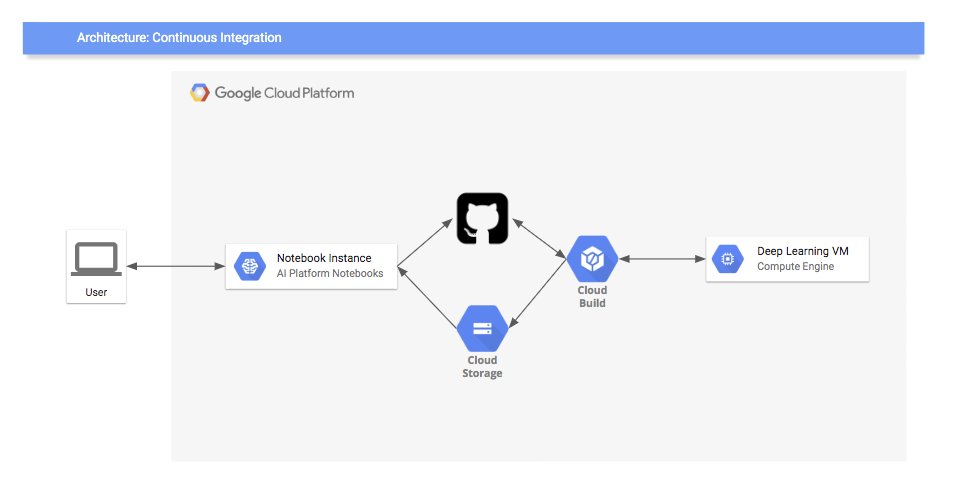

# Fully Configured Example of CI/CD For Notebooks On Top Of GCP

This repository includes fully functional Continues integration && Continues delivery systems for [Jupyter](https://jupyter.org/) Notebooks. 

The main purpose of the repository to be a reference example of the implementation that can be easily replicated for other repositories when needed. The repository contains one notebook ```demo.ipynb```, and code for CI/CD for that notebook.

Each of the components extensively covered with comments and documentation so it is simpler to understand what is going on and subsequently to replicate similar setup on your repository.

## Underlying Services

In order to replicate same setup, following services/products of [Google Cloud Platform](https://cloud.google.com/) will be used:

* [Cloud Deep Learning VMs](https://cloud.google.com/deep-learning-vm/)
* [Cloud Builder](https://cloud.google.com/cloud-build/) 
* [Cloud Storage](https://cloud.google.com/storage/)
* GitHub (or [Cloud Source Repository](https://cloud.google.com/source-repositories/)) 

Optional, depends on your setup:
* [Secrets Management](https://cloud.google.com/solutions/secrets-management/) - for both CI and CD components
* [Cloud Functions](https://cloud.google.com/functions/) - for CD component only
* [Cloud Scheduler](https://cloud.google.com/scheduler/) - for CD component only

Rest of the document explains how exactly this CI/CD works.

# Continues Integration (CI)

On the high-level CI system looks like this:



The simples explanation of how everything works together would be to follow live of a broken commit (commit that breaks notebook).

## Life of a broken commit

* For example user pushes commit that makes Notebook broken;
* GitHub (or [Cloud Source Repository](https://cloud.google.com/source-repositories/)) has a special pre-configured hook that triggers [Cloud Builder](https://cloud.google.com/cloud-build/) each time when new commit pushed to the master. You can read more about how to setup such hook [here](https://cloud.google.com/cloud-build/docs/run-builds-with-github-checks).
* [Cloud Builder](https://cloud.google.com/cloud-build/) looks for the file [cloudbuild.yaml](cloudbuild.yaml) that describes all the steps.
* cloudbuild.yaml includes the following steps for the CI:
   * clone the repository
   * checkout required commit under test
   * executes testing logic in [run_notebook_instance.sh](run_notebook_instance.sh) which does the following steps:
     * upload notebook (you can upload other files if needed) to the GCS
     * use [gcp-notebook-executer](https://blog.kovalevskyi.com/how-to-submit-jupyter-notebook-for-overnight-training-on-gcp-4ce1b0cd4d0d) to start training of the notebook
     * wait till notebook execution if finished
     * check if remote cloud storage has FAILED file marker
* mark build as green or red

## What do I need to do to create CI for my repository?

1. Make sure that your notebook self-contained and can be executed on top of one of available [Cloud Deep Learning VMs image families](https://cloud.google.com/deep-learning-vm/docs/images)
1. Add [hook to could build to your repository](https://cloud.google.com/cloud-build/docs/run-builds-with-github-checks)
1. Create testing script [run_notebook_instance.sh](run_notebook_instance.sh) based on our script. In the script you need to customize:
    * image family that need to be used
    * VM configuration (GPU type, VM shape, etc)
    * name of the notebook
    * you might need update logic that uploads a file to cloud storage
1. Create [cloudbuild.yaml](cloudbuild.yaml) similar to the one from this repository.

# Hot To Get Help

There are several ways you can get help but the fastest one probably would be to send the letter to the: https://groups.google.com/forum/#!forum/google-dl-platform .
